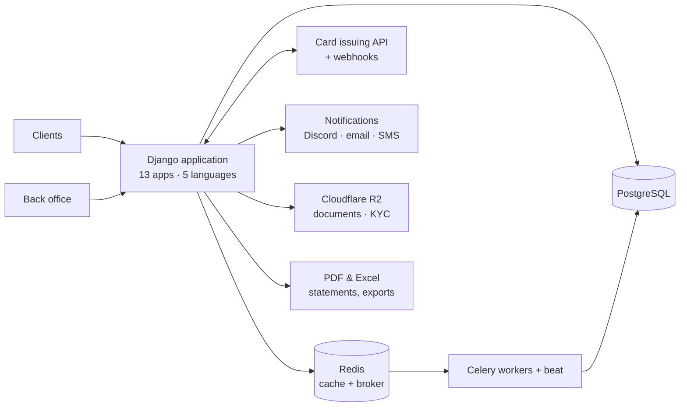

# GoldenHive — Architecture

Case study of an online-bank-style wealth management platform: accounts,
payment cards, investments and KYC. Freelance work for a client, sole
developer.

**Live:** [www.goldenhive.io](https://www.goldenhive.io)
**Role:** sole developer — November 2024 to May 2026, 210 commits
**Size:** 13 Django apps, ~27,000 lines of Python, 237 templates, 5 languages

> **No source code here.** The repository belongs to the client and stays
> private. This document describes how the platform is built.

## The problem

A wealth management firm needed its clients to hold an account, receive a
payment card, subscribe to investment products and follow their returns — in
five languages, with the identity checks that come with handling other
people's money.

Off-the-shelf banking software was out of reach for the budget. The platform
had to be built as a product, then handed over to the client as something they
could run themselves.

## Constraints that shaped the design

- **Card issuing is an external dependency.** The provider's API defines what
  is possible; the platform has to absorb its vocabulary without being welded
  to it.
- **Five languages from day one**, not retrofitted.
- **Everything is auditable.** Who changed what, when — a regulator's question
  is also an engineering requirement.
- **The client must be able to take over.** The infrastructure had to move to
  their accounts without a service interruption.

## Service map

## What it does

**Card issuing.** Integration with a card issuing provider's API, plus a
written migration plan to a second provider so the platform would not be
trapped by one vendor. Webhook handling for the card lifecycle, and bulk card
blocking from the back office for when something goes wrong at scale.

**Investments.** A product catalog, subscription flow, returns, withdrawals
and a Chart.js dashboard. A generated demo history lets a new account show a
meaningful curve from the first login.

**Money and compliance.** Transactions, a fee engine, KYC, legal documents,
PDF statement generation (ReportLab) and Excel exports.

**Operations.** Admin notifications over Discord, email and SMS. Full audit
trail through django-easy-audit.

## Technical decisions

| Decision | Why | Trade-off |
|---|---|---|
| Wrap the card provider behind an internal interface | A second provider was already foreseen; the domain model should not speak the vendor's dialect | An abstraction written against one implementation is a guess until the second one lands |
| Automated translation pipeline (DeepL + polib) rather than hand-managed `.po` files | Five languages stay in sync as the product changes; a human reviews, a script does the rest | Machine translation needs review on legal and financial wording |
| MFA through django-allauth rather than a custom implementation | Authentication is the wrong place to be original | Bound to the library's upgrade path |
| Audit logging at the ORM level (django-easy-audit) | Nothing escapes it, including admin actions | Write volume grows; the table needs a retention policy |
| AWS first, then Railway | Early architecture favoured flexibility; once the shape was stable, hosting cost mattered more | A migration nobody budgeted for |

## Operations

- Docker, PostgreSQL, Redis, Celery workers and beat.
- Cloudflare R2 for document and KYC storage, Cloudflare Tunnel for access.
- Hosted on **AWS, then migrated to Railway** to cut running costs.
- **Infrastructure handed over to the client** — Railway and Cloudflare moved
  to their own accounts, with no service interruption.

## Stack

`Python` `Django` `Django REST Framework` `Celery` `Redis` `PostgreSQL`
`Docker` `AWS` `Railway` `Cloudflare R2` `django-allauth` `django-easy-audit`
`ReportLab` `Chart.js` `PostCSS`

## Status

The platform is functional and production-ready. The project was stopped for
commercial reasons, not technical ones.

## Related

- [StarShipDealers — Architecture](https://github.com/Meranhor/starshipdealers-architecture)
- [NegotiNation — Architecture](https://github.com/Meranhor/negotination-architecture)
